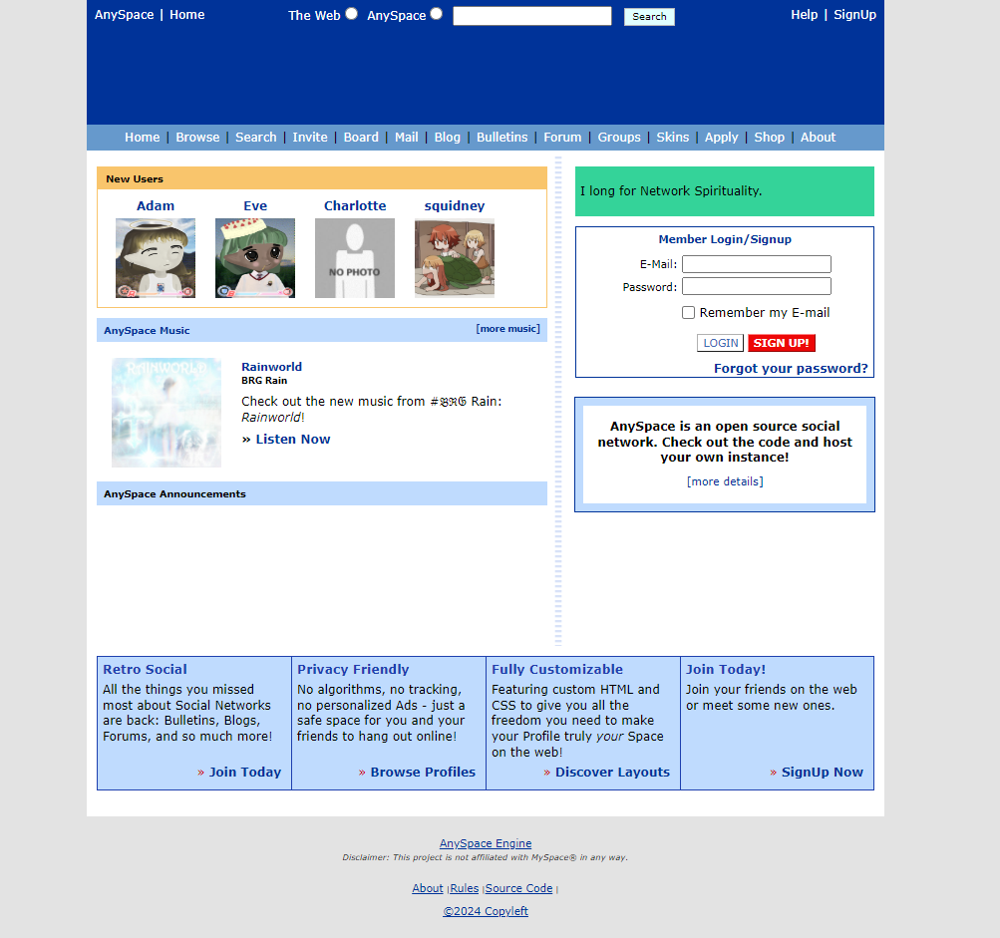

# AnySpace Installation & Hosting Guide

## Installation
1. **Download the ZIP** of this repository and upload it to your server.
2. Point the web server's document root to the `public/` directory.
3. Ensure the web server user has write permission to `core/`, `public/media/pfp/`, and `public/media/music/`.
4. Visit `/install.php` in your browser to run the installation wizard. It will configure the database, generate `core/config.php`, and create the first administrator account.

_No command line needed see the [Beginner Guide](docs/INSTALL.md) for a step-by-step walkthrough._

Advanced users can alternatively:
- Clone the repository instead of downloading a ZIP.
- Create a MySQL database and import `schema.sql`.
- Copy `core/config.php.example` to `core/config.php` and adjust database credentials and site settings.

## Hosting Recommendations
AnySpace runs on standard PHP/MySQL hosting. Below are suggested providers ordered from budget friendly to more pricey with notes on why you might choose each.

### Shared Hosting
- **Namecheap Stellar** – low monthly cost and supports PHP & MySQL, ideal for experimenting or small friend groups.
- **Bluehost Basic** – a bit more expensive but offers better support and one‑click SSL certificates for small communities.
- **SiteGround StartUp** – higher price but strong performance and security features, useful when traffic begins to grow.

### VPS Hosting
- **DigitalOcean Droplet (Basic)** – inexpensive entry VPS giving you full server control for custom configurations.
- **Linode 4GB** – more RAM/CPU and reliable network; good for medium communities or multiple services.
- **Amazon Lightsail** – priciest here but integrates with the AWS ecosystem and offers scalability for large deployments.

It's recommended to set the following in your `php.ini`

```
file_uploads = On
upload_max_filesize = 10M
post_max_size = 15M
max_execution_time = 60
max_input_time = 120
memory_limit = 128M
```

### Admin Panel
The admin panel should not be made available to the public. The id of the admin user can be set in `config.php`, by
default it is set to user with id 1. Future plans include multi-user access to the admin panel using a permissions
system.  

## Features

- [x] Admin Panel
- [x] Authentication
  - [x] Login/Logout
  - [x] Registration
  - [x] Magic Login (passwordless login via email)
  - [ ] Email Verification
- [x] Blog
- [x] Bulletins
- [x] Comment System
- [x] Favorite Users
- [x] **Forum (Production Ready)**
  - [x] Categories and Forums
  - [x] Topics and Posts
  - [x] Rate Limiting & Anti-Spam
  - [x] Moderation Tools
  - [x] User Permissions
  - [x] Search Functionality
  - [x] Notifications & Subscriptions
  - [x] File Attachments
  - [x] Content Filtering
  - [x] Audit Logging
  - [x] Statistics Caching
  - [x] Reactions & Polls
- [x] Friend System
- [x] Group System
- [x] Layout sharing feature
- [x] Private Messaging
- [x] Report System
- [x] Editable static pages (homepage, about)
- [x] Anti-spam questions for registration
- [x] Session Management
- [x] User Browser
- [x] User Search
- [x] User Profiles
- [x] Custom HTML/CSS Profile Layouts

For detailed forum documentation, see [docs/forum/README.md](docs/forum/README.md).

## Screenshot



## Project Structure

```
project-root/
    │
├───admin/                    # Administration tools and dashboards
│
├───core/                     # Core application logic
│   ├───components/           # Shared site components
│   ├───site/                 # Site-specific functionality
│   └───tools/                # Tools and utilities
│
├───lib/                      # Libraries and dependencies
│
└───public/                   # Publicly accessible files
    │
    ├───blog/                 # Blog related files
    │   └───editor/           # Trumbowyg WYSIWIG editor components
    │       ├───langs/        # Language files for Trumbowyg
    │       └───plugins/      # Plugins for Trumbowyg 
    │
    ├───bulletins/             # Bulletins related files
    ├───docs/                  # Documentation files
    ├───forum/                 # Forum related files
    ├───groups/                # Groups related files
    ├───layouts/               # Layout related files
    ├───media/                 # User uploaded media files
    │   ├───music/             # Music files
    │   └───pfp/               # Profile picture files
    │
        └───static/                # Static assets
        ├───css/               # CSS files
        ├───icons/             # Icon files
        └───img/               # Image files

```

## Tests

The `tests` directory contains standalone PHP scripts that exercise key forum
features. To run the full test suite, execute the following from the project
root:

```bash
for t in tests/*.php; do php "$t"; done
```

Each script uses an SQLite database and prints its status to the console.

## Quirks
- Developed with PHP 5.3 compatibility in mind due to limitations of developer hardware
- Database schema will change frequently at this stage of development. If you receive a "PDO exception" you most likely need to create the appropriate  table or column.

## Credits

[MySpace](myspace.com) for making a great social network during my childhood and inspiration <br>
[superswan](https://github.com/superswan) for making AnySpace <br>
[SpaceHey](https://spacehey.com) for being a chill place to hang! <br>
[An](https://spacehey.com/an) for also creating SpaceHey <br>
[This spacemy.xyz codebase](https://github.com/Ahe4d/spacemy.xyz) <br>
[Trumbowyg](https://github.com/Alex-D/Trumbowyg)<br>
[@wittenbrock](https://github.com/wittenbrock/toms-myspace-page) - Tom's MySpace page!
